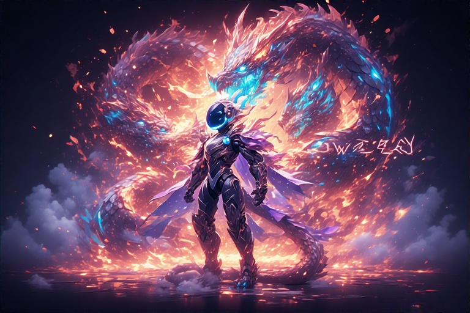

<div align="center">
  
# ⚡ OWEN — WhatsApp Bot  

**Multi-Mode | AI-Powered | Fast | Feature-Rich**  
Built with 💚 on top of [Baileys](https://github.com/WhiskeySockets/Baileys)  

 
 
 


</div>

---

## ✨ Features

✅ **Multi-Mode Operation** — Public, Self, Private & Admin-Only  
✅ **AI Commands** — ChatGPT-style answers & image enhancement  
✅ **Group Management** — Welcome messages, tagall, mute/unmute, ban/unban  
✅ **Anti-Spam System** — Blocks spam & floods automatically  
✅ **Media Tools** — Stickers with watermark, video/image conversion  
✅ **Downloader Tools** — YouTube, Instagram, TikTok, and more  

---

## 🚀 Quick Start

### 🖥️ Software Requirements (PC)
You'll need to install the following software on your computer before you get started:
1.  **VS Code:** A powerful and free code editor.
2.  **Git:** A version control system to clone the bot's repository.
3.  **Node.js:** The JavaScript runtime environment that powers the bot.
4.  **ffmpeg:** A tool for handling video, audio, and other multimedia files.

### 1️⃣ Install Requirements
```bash
git clone https://github.com/USERNAME/REPO.git
cd REPO
npm install or npm i
```

### 2️⃣ Configure
Edit:
```js
// .env
OWNER_NUMBERS=2799999999
```
Add your number in international format (without `+`).

### 3️⃣ Start Bot
```bash
node index.js
```
📱 On first run, enter your WhatsApp number to get a **Pairing Code**.

---

## 🛠️ Commands Preview
> Type `.menu` in WhatsApp to see the full command list.

| Category        | Examples                                  |
|-----------------|-------------------------------------------|
| **AI**          | `.chatgpt Hello`                          |
| **Group**       | `.tagall`                                 |
| **Media**       | `.swm pack|author`                        |
| **Owner**       | `.public`, `.private`, `.mode`            |
| **Games**       | `.pokemon`, `.mtg`                        |

---

## 📷 Banner

<div align="center">

</div>

---

## 📜 License
ᴛʜɪꜱ ᴘʀᴏᴊᴇᴄᴛ ɪꜱ ʟɪᴄᴇɴꜱᴇᴅ ᴜɴᴅᴇʀ ᴛʜᴇ **MIT License**

---

### 🚧 Coming Soon...

> ᴏᴡᴇɴ ɪꜱ ꜱᴛɪʟʟ ᴜɴᴅᴇʀ ᴀᴄᴛɪᴠᴇ ᴅᴇᴠᴇʟᴏᴘᴍᴇɴᴛ ᴀɴᴅ ɴᴏᴛ ʀᴇʟᴇᴀꜱᴇᴅ ᴘᴜʙʟɪᴄʟʏ ʏᴇᴛ. ꜱᴛᴀʏ ᴛᴜɴᴇᴅ — ɪᴛ'ꜱ ᴡᴏʀᴛʜ ᴛʜᴇ ᴡᴀɪᴛ.

---

⭐ **Star this repo** ɪꜰ ʏᴏᴜ ᴇɴᴊᴏʏ ᴏᴡᴇɴ ᴀɴᴅ ᴡᴀɴᴛ ᴍᴏʀᴇ ꜰᴇᴀᴛᴜʀᴇꜱ!
